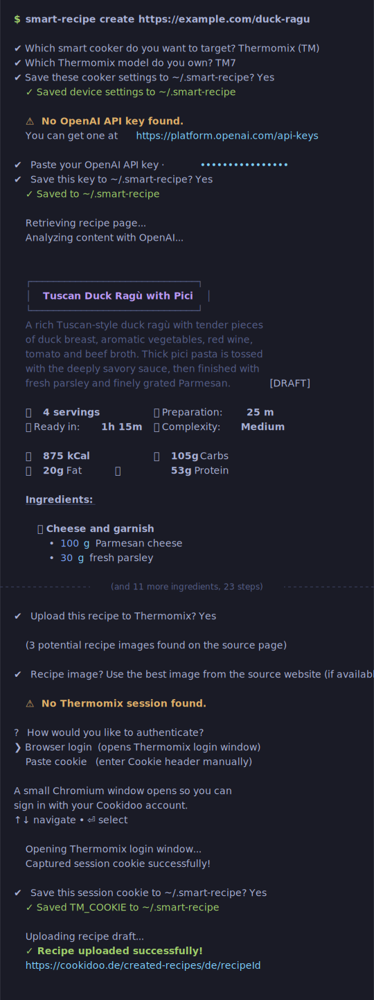
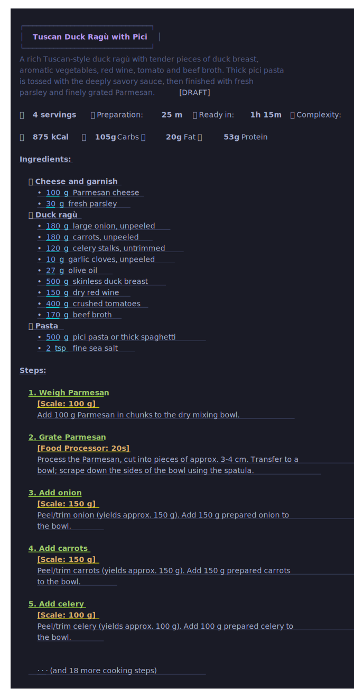

# SmartRecipe

**Turn almost any recipe page into an editable Monsieur Cuisine Smart or Thermomix recipe draft.**

SmartRecipe reads a recipe from the web, asks OpenAI to turn it into a device-compatible workflow (Monsieur Cuisine Smart or Thermomix TM5/TM6/TM7), displays it in the terminal, and optionally creates a draft in your account. You can then open the draft, review it, edit it, and cook it on your device.

It is made for people who find good recipes online but do not want to manually rebuild every ingredient, weighing step, cooking mode, temperature, speed, and image inside their appliance's app.

> [!IMPORTANT]
> SmartRecipe is built for modern smart cookers. For Monsieur Cuisine, it supports the **Monsieur Cuisine Smart / MC3.0** (not the older Monsieur Cuisine connect / MC2.0). For Thermomix, it supports the **Thermomix TM7**, **TM6**, and **TM5** devices.

---

## What SmartRecipe does

Give SmartRecipe a recipe URL:

```bash
smart-recipe import-url "https://example.com/my-favorite-recipe"
```

It will:

1. Read the recipe page and show you the extracted markdown.
2. Ask for your OpenAI API key if none is configured (and offer to save it).
3. Convert the recipe into a device-compatible workflow (Monsieur Cuisine Smart or Thermomix TM5/TM6/TM7).
4. Display the fully formatted recipe in the terminal — ingredients, steps, modes, timings, and nutrients.
5. Ask whether you want to upload it to the selected device.
6. If you do: guide you through authentication (browser login or cookie paste) and offer to save the session.
7. Upload a recipe image from the page, or create a new one with OpenAI.



The result is not just copied text. SmartRecipe tries to turn the recipe into a device-native cooking flow with structured ingredients, steps, timings, temperatures, speeds, rotation direction, scale steps, kneading, steaming, roasting, slow cooking, and other Smart modes where appropriate.

You still stay in control: SmartRecipe creates **drafts**, not final recipes. Review everything before cooking.



---

## Who this is for

SmartRecipe is for you if you:

* own a Monsieur Cuisine Smart
* collect recipes from blogs, magazines, YouTube descriptions, or cooking sites
* want to cook those recipes with guided Smart steps
* dislike manually entering recipes into the Monsieur Cuisine ecosystem
* want AI help adapting normal recipes into appliance-friendly workflows
* are comfortable running a small command-line tool, or have someone who can set it up once for you

It is also useful for:

* recipe bloggers who want to test Smart-compatible versions of their recipes
* home cooks who want a private recipe collection on their device
* developers who want a typed TypeScript toolkit for Monsieur Cuisine Smart recipe generation and upload

---

## What it is not

SmartRecipe is **not** an official Lidl or Monsieur Cuisine product.

It does not:

* guarantee that every web page can be parsed perfectly
* guarantee that AI-generated cooking steps are safe or correct
* bypass website access restrictions
* publish recipes for you
* replace your judgment when cooking
* support Monsieur Cuisine connect / MC2.0

Always check ingredient quantities, allergens, food safety, cooking times, temperatures, and whether the steps make sense for your device.

---

## Requirements

You need:

* **Node.js 20.18 or newer**
* **Git**
* an **OpenAI API key**
* a **Monsieur Cuisine / Lidl Plus** account OR a **Thermomix / Cookidoo** account
* a **Monsieur Cuisine Smart** OR a **Thermomix TM7 / TM6 / TM5** device

OpenAI API usage may cost money, depending on your OpenAI account and the model you use.

---

## Install

SmartRecipe is not published to the npm registry yet. Install it directly from GitHub:

```bash
npm install -g github:gerkensm/smart-recipe
smart-recipe --help
```

To install a specific branch, tag, or commit:

```bash
npm install -g github:gerkensm/smart-recipe#main
```

This works because npm can install GitHub packages. During installation, npm runs the package build step and creates the CLI from the TypeScript source.

### Install from a local checkout

```bash
git clone https://github.com/gerkensm/smart-recipe.git
cd smart-recipe
npm install
npm run build
node dist/cli/main.js --help
```

The examples below use `smart-recipe`. If you run from a local checkout, replace it with:

```bash
node dist/cli/main.js
```

---

## Set up OpenAI

If you run `import-url` without an API key configured, SmartRecipe will ask for it interactively and offer to save it. You only need to do this once.

Alternatively, set it in advance via a `.env` file, `~/.smart-recipe`, or your shell:

```bash
OPENAI_API_KEY=sk-...
```

Default recipe generation settings:

```bash
OPENAI_MODEL=gpt-5.5
OPENAI_REASONING_EFFORT=medium
```

Image generation defaults:

```bash
OPENAI_IMAGE_MODEL=gpt-image-2
OPENAI_IMAGE_SIZE=1024x1024
OPENAI_IMAGE_QUALITY=medium
```

You can also use `.env.example` as a starting point.

---

## Device Setup & Login

SmartRecipe supports both **Monsieur Cuisine** (MC) and **Thermomix** (TM). When you run `import-url` for the first time, it will interactively prompt you to choose your target device and (if targeting Thermomix) your Thermomix model (TM7, TM6, or TM5). It will offer to save these settings to `~/.smart-recipe`.

You can also specify the target device via environment variables or CLI options (e.g. `--device tm --tm-version tm7`).

### Log in to Monsieur Cuisine or Thermomix

When you choose to upload, SmartRecipe checks if you have a valid session. If not, it will ask how you want to authenticate:

* **Browser login** — opens a small Chromium window. Sign in with your Lidl Plus (MC) or Cookidoo (TM) account. SmartRecipe captures the session cookie automatically.
* **Paste cookie** — shows step-by-step instructions for copying the cookie from your browser's DevTools, then saves it.

In both cases, SmartRecipe offers to save the session to `~/.smart-recipe` so you do not need to log in again.

### Log in in advance

If you prefer to authenticate before your first import:

```bash
# For Monsieur Cuisine
smart-recipe login-browser --device mc --save

# For Thermomix
smart-recipe login-browser --device tm --save
```

This opens a small browser window. Log in with your normal Lidl Plus or Cookidoo account. SmartRecipe captures the session cookie and stores it in `~/.smart-recipe`.

### Pass a cookie directly

If you already have a cookie (from DevTools → Network → any request → Request Headers → `Cookie:`), pass it with `--cookie`:

```bash
# Monsieur Cuisine
smart-recipe import-url "https://example.com/recipe" --device mc --cookie "cookie_name=value; ..."

# Thermomix
smart-recipe import-url "https://example.com/recipe" --device tm --cookie "cookie_name=value; ..."
```

Or store it permanently:

```bash
# in .env or ~/.smart-recipe
MC_COOKIE="cookie_name=value; another_cookie=value; ..."
TM_COOKIE="cookie_name=value; another_cookie=value; ..."
```

> [!WARNING]
> Your session cookies act like login sessions. Keep them private. Do not commit `.env`, `~/.smart-recipe`, logs, screenshots, terminal history, or pasted cookies to GitHub. If you accidentally share a cookie, log out of your Monsieur Cuisine / Lidl Plus or Cookidoo account and log back in to invalidate the old session.

---

## Import your first recipe

Just run:

```bash
smart-recipe import-url "https://example.com/recipe"
```

SmartRecipe will walk you through everything interactively — API key, recipe generation, a preview in the terminal, and whether to upload.

If you want to skip every prompt and always upload automatically:

```bash
smart-recipe import-url "https://example.com/recipe" --yes
```

If you want to generate the recipe and inspect it without uploading:

```bash
smart-recipe import-url "https://example.com/recipe" --dry-run
```

After upload, SmartRecipe prints the draft URL. Open it, review the recipe, adjust anything that needs human judgment, and save it in your Monsieur Cuisine account.

---

## Recreate the recipe image

By default, SmartRecipe uploads the best image it finds on the source recipe page.

To avoid reusing the website image, ask OpenAI to create a new original image:

```bash
smart-recipe import-url "https://example.com/recipe" --recreate-image
```

The generated image is designed to look like a realistic home-cooked dish: appetizing, natural, and not like glossy studio food photography.

You can also let the image generator see the source page images as loose visual context:

```bash
smart-recipe import-url "https://example.com/recipe" --recreate-image-with-source-images
```

This still asks for a new image. The source images are only used to understand the dish.

Set image options per run:

```bash
smart-recipe import-url "https://example.com/recipe" \
  --recreate-image \
  --image-size 1536x1024 \
  --image-quality high
```

---

## Useful commands

### Check what SmartRecipe extracts from a page

```bash
smart-recipe retrieve "https://example.com/recipe"
```

This prints the cleaned recipe text and selected image candidates.

### Check your Monsieur Cuisine login

```bash
smart-recipe me
```

### List recent draft recipes

```bash
smart-recipe drafts
```

### Print the generated recipe as JSON

```bash
smart-recipe import-url "https://example.com/recipe" --dry-run --full-response --json
```

### Validate a recipe JSON file

```bash
smart-recipe validate recipe.json
```

### Print the model-facing schema

```bash
smart-recipe schema
```

### Print the generation prompt hints

```bash
smart-recipe prompt
```

### Show locale and catalog data

```bash
smart-recipe catalog
```

---

## Common options

| Option                                | What it does                                                                                           |
| ------------------------------------- | ------------------------------------------------------------------------------------------------------ |
| `--yes`                               | Always upload without asking for confirmation (mirrors the old default behaviour).                     |
| `--dry-run`                           | Generate and display the recipe without uploading it. Takes priority over `--yes`.                     |
| `--device <device>`                   | Target device: `mc` (Monsieur Cuisine) or `tm` (Thermomix).                                             |
| `--tm-version <version>`              | Thermomix device model version: `tm7`, `tm6`, or `tm5`.                                                |
| `--no-print-markdown`                 | Do not pretty-print the retrieved page markdown before generation.                                     |
| `--full-response`                     | Print the extracted page summary, generated recipe, payload, image info, and upload response.          |
| `--json`                              | Print machine-readable JSON (disables all interactive prompts).                                        |
| `--log-level debug`                   | Show more detailed progress logs.                                                                      |
| `--model <model>`                     | Choose the OpenAI recipe model.                                                                        |
| `--reasoning <effort>`                | Choose OpenAI reasoning effort: `minimal`, `low`, `medium`, or `high`.                                 |
| `--recreate-image`                    | Generate a new recipe image instead of uploading the source image.                                     |
| `--recreate-image-with-source-images` | Generate a new image while using source images as loose context.                                       |
| `--image-model <model>`               | Choose the OpenAI image model.                                                                         |
| `--image-size <size>`                 | Choose generated image size.                                                                           |
| `--image-quality <quality>`           | Choose image quality: `low`, `medium`, `high`, or `auto`.                                              |
| `--cookie <cookie>`                   | Pass a Monsieur Cuisine or Thermomix cookie directly (skips the auth prompt).                          |
| `--env <path>`                        | Load a specific env file.                                                                              |

---

## Supported languages and locales

### Monsieur Cuisine
SmartRecipe bundles verified Monsieur Cuisine catalog data for:
* Czech: `cs-CZ`
* Polish: `pl-PL`
* German: `de-DE`
* French: `fr-FR`
* English: `en-US`
* Italian: `it-IT`

Default Monsieur Cuisine locale:
```bash
MC_LOCALE=de-DE
```

Planned Monsieur Cuisine locale coverage includes Spanish, Dutch, Portuguese, Hungarian, Greek, Slovak, Turkish, Romanian, Finnish, Croatian, Bulgarian, and Swedish.

### Thermomix (Cookidoo)
SmartRecipe supports Cookidoo locales based on domains:
* German (Germany): `de-DE` (via `cookidoo.de`)
* English (US/International): `en-US` (via `cookidoo.international`)
* French (France): `fr-FR` (via `cookidoo.fr`)
* Italian (Italy): `it-IT` (via `cookidoo.it`)
* Polish (Poland): `pl-PL` (via `cookidoo.pl`)
* Czech (Czechia): `cs-CZ` (via `cookidoo.cz`)

Default Thermomix locale:
```bash
TM_LOCALE=de-DE
```

---

## How SmartRecipe thinks about recipes

SmartRecipe tries to create recipes that feel native to your smart cooker instead of simply pasting normal cooking instructions into a draft.

It automatically maps standard instructions to device-native modes:
* **Monsieur Cuisine Smart**: Supports custom modes like roast, slow cooking, liquid/solid/soft dough kneading, steam, sous-vide, turbo, precleaning, fermentation, rice cooking, food processor, puree, and smoothie.
* **Thermomix TM7/TM6/TM5**: Adapts to Thermomix-specific guided modes. If targeting a TM5, it automatically clamps cooking speeds and prevents generating unsupported modes like browning/roast or sous-vide.
* **Device Limits**: Respects mixing bowl capacity (2.2L max capacity for TM/MC), kneading weights (restricts kneading to 800g of flour), and temperature ranges (clamps browning temperatures to specific allowed integers like `[140, 145, 150, 155, 160]`), and handles reverse rotation automatically for delicate items.
* **Clean Annotations**: Removes unnecessary manual mixing annotations to prevent crossed-out lines in the device UI.

This helps, but it is not a safety guarantee. Treat the generated recipe like a smart draft from an assistant, not like a tested cookbook recipe.

---

## Example workflow

### First-time setup (fully guided)

```bash
# 1. Install
npm install -g github:gerkensm/smart-recipe

# 2. Run — SmartRecipe walks you through everything
smart-recipe import-url "https://example.com/recipe"
# → asks for your OpenAI API key (and offers to save it)
# → generates and displays the recipe in the terminal
# → asks if you want to upload
# → guides you through Monsieur Cuisine login (and offers to save the session)
# → prints the draft URL
```

### Non-interactive / scripted usage

```bash
# Set credentials once
export OPENAI_API_KEY="sk-..."
export MC_COOKIE="..."

# Always upload without prompts
smart-recipe import-url "https://example.com/recipe" --yes

# Generate only, print JSON
smart-recipe import-url "https://example.com/recipe" --dry-run --json
```

---

## Troubleshooting

### `No Monsieur Cuisine cookie found`

If you are running interactively, SmartRecipe will offer browser login or step-by-step cookie instructions automatically when you choose to upload.

To pre-authenticate:

```bash
smart-recipe login-browser --save
```

Or pass a cookie manually with `--cookie`.

### The recipe looks wrong

Try:

```bash
smart-recipe retrieve "https://example.com/recipe"
```

Check whether the source page was extracted correctly. Some pages hide recipe data, mix several recipes, or include unrelated page text.

### The import works, but the cooking flow is odd

Run a dry run with the full response:

```bash
smart-recipe import-url "https://example.com/recipe" --dry-run --full-response
```

Review the generated JSON before upload. AI can misunderstand cooking order, ingredient quantities, or device constraints.

### The generated image is not useful

Try one of these:

```bash
smart-recipe import-url "https://example.com/recipe" --recreate-image
```

```bash
smart-recipe import-url "https://example.com/recipe" --recreate-image-with-source-images
```

If the source page has poor or unrelated images, recreating the image may work better than uploading the original.

### Installation fails

Check that you have:

```bash
node --version
npm --version
git --version
```

Node.js must be `20.18` or newer.

---

## Configuration reference

| Variable                  |       Default | Purpose                                                   |
| ------------------------- | ------------: | --------------------------------------------------------- |
| `OPENAI_API_KEY`          |         empty | Required OpenAI API key.                                  |
| `OPENAI_MODEL`            |     `gpt-5.5` | Recipe generation model.                                  |
| `OPENAI_REASONING_EFFORT` |      `medium` | Reasoning effort for recipe conversion.                   |
| `OPENAI_IMAGE_MODEL`      | `gpt-image-2` | Image generation model.                                   |
| `OPENAI_IMAGE_SIZE`       |   `1024x1024` | Generated image size.                                     |
| `OPENAI_IMAGE_QUALITY`    |      `medium` | Generated image quality.                                  |
| `TARGET_DEVICE`           |          `mc` | Default target device: `mc` or `tm`.                      |
| `MC_LOCALE`               |       `de-DE` | Monsieur Cuisine locale.                                  |
| `MC_COOKIE`               |         empty | Optional saved Monsieur Cuisine cookie.                   |
| `MC_LOGIN`                |         empty | Optional Lidl Plus email for browser login prefill.       |
| `MC_PW`                   |         empty | Optional Lidl Plus password for browser login automation. |
| `TM_VERSION`              |         `tm6` | Default Thermomix version: `tm7`, `tm6`, or `tm5`.        |
| `TM_LOCALE`               |       `de-DE` | Thermomix locale.                                         |
| `TM_COOKIE`               |         empty | Optional saved Thermomix cookie.                          |
| `TM_LOGIN`                |         empty | Optional Cookidoo email for browser login prefill.        |
| `TM_PW`                   |         empty | Optional Cookidoo password for browser login automation.  |

---

## For developers

SmartRecipe is a TypeScript project. It can be used as a CLI and as a library.

Main modules:

* `smart-recipe/retriever`: fetch recipe pages, convert them to Markdown, and collect image candidates
* `smart-recipe/llm`: OpenAI recipe and image generation
* `smart-recipe/recipes`: typed recipe schema, normalization, validation, Smart mode helpers, payload creation, and terminal pretty-printer
* `smart-recipe/devices`: the unified `DeviceAdapter` abstraction and implementations (`MonsieurCuisineAdapter` and `ThermomixAdapter`)
* `smart-recipe/mc`: Monsieur Cuisine Smart client, login cookie handling, draft upload, and image upload
* `smart-recipe/tm`: Thermomix (Cookidoo) API client, authentication, cookie proxy, and draft upload
* `smart-recipe/pipeline`: `generateSmartRecipe` and `uploadSmartRecipe` phase functions, plus the legacy combined `importRecipe` wrapper

Run checks:

```bash
npm run typecheck
npm test
npm run build
```

Inspect package contents before publishing:

```bash
npm pack --dry-run
```

More implementation notes live in [`docs/technical.md`](docs/technical.md).

---

## Legal and responsibility notes

SmartRecipe is an independent open-source project. It is not affiliated with, endorsed by, or supported by Lidl, Monsieur Cuisine, Silvercrest, or OpenAI.

Recipe websites, images, and texts may be protected by copyright or other rights. Make sure you have the right to use any imported or generated material for your intended purpose.

Generated recipes can be wrong. You are responsible for reviewing drafts before cooking or sharing them.

---

## Credits & Inspiration

The Thermomix (Cookidoo) integration in SmartRecipe is inspired by and credits the following community projects:
* **TypeScript**: [@recode-software/cookidoo-api](https://github.com/recode-software/cookidoo-api) by Recode Software.
* **Python**: [cookidoo-api](https://github.com/miaucl/cookidoo-api) by Cyrill Raccaud (`miaucl`).

These projects provided invaluable references for Cookidoo API routes, authentication proxy flows, and schema structures.

---

## License

MIT License. See [`LICENSE`](LICENSE).
